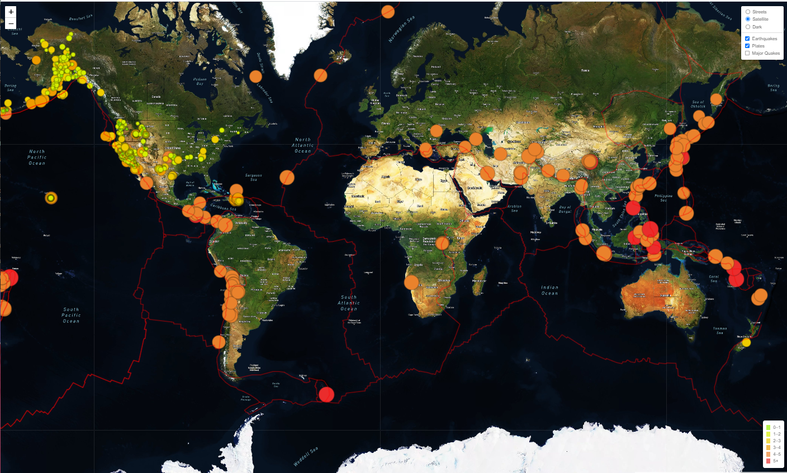
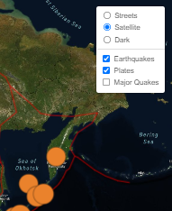
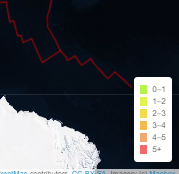
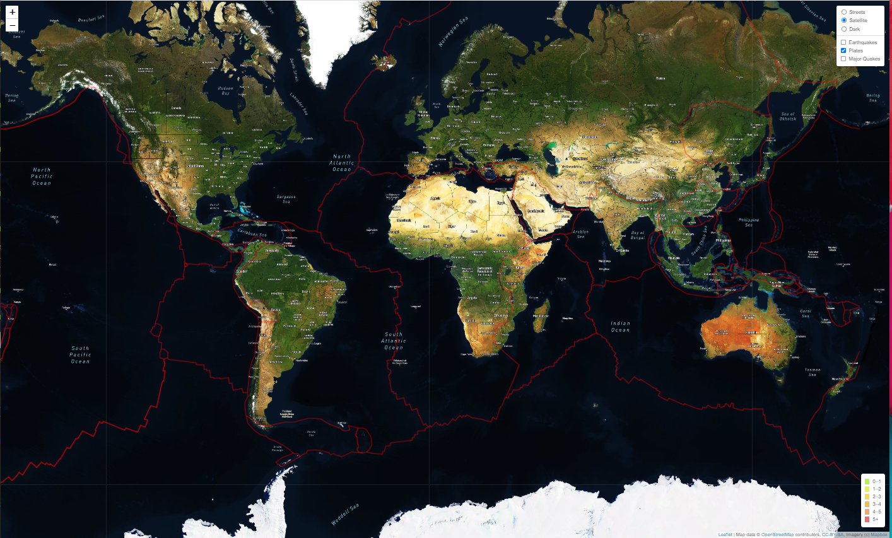
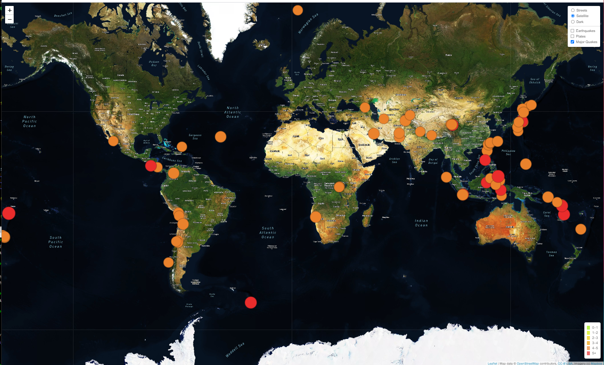
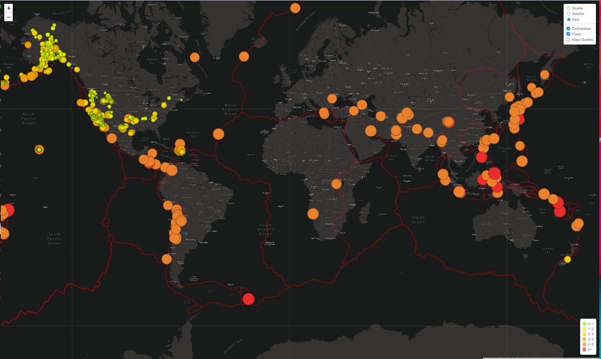
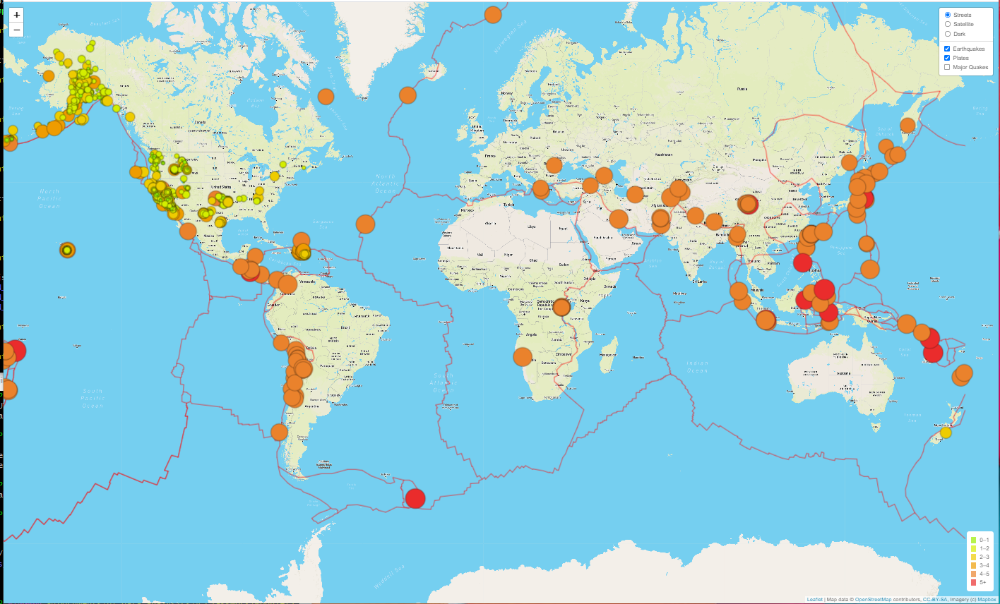

# Mapping_Earthquakes

We were asked to help Basil from the Disaster Reporting Network to create a web-based mapping visualization of earthquake data from the US Geological Survey for all earthquakes over the last 7 days (a period from approximately May 22, 2021 to May 29, 2021).

The magnitude and location of each earthquake are plotted with a circle whose radius is proportional to the magnitude of the earthquake.
Each circle is color-coded, where darker colors reflect greater magnitudes.
The color vs. magnitude relationship is reflected in a legend on the map.
Each circle also has a popup marker giving the magnitude and location data.

The map has selectable base layers using the Mapbox 'streets', 'satellites', and 'dark' styles.
The map also has overlays showing: a) all earthquakes over the last seven days, b) only the major earthquakes during that period, and c) the tectonic plate boundaries around the globe.

This project heavily used Git's branching abilities (but sparingly used Git's  merging abilities).

Technologies Used:
- Javascript
- Leaflet API
- Mapbox API (and OpenStreetMap.org data)
- D3 (Data Driven Documents Javascript Library)
- HTML / CSS
- GeoJSON
- Git and Github

## Project Overview

Many Git branches were created during this project (shown below), however only the final 'Earthquakes_past7days' was merged into the main branch and submitted for review.

- **main**
- **Earthquakes_past7days**
- Mapping_GeoJSON_Polygons
- Mapping_GeoJSON_Linestrings
- Mapping_GeoJSON_Points
- Mapping_Lines
- Mapping_Multiple_Points
- Mapping_Single_Points
- Simple_Leaflet_Map

## Results

The final product is shown in Figure 1 below.
Note the base layer / overlay control object in the upper right.
A close-up view of the base layer / overlay control is shown in Figure 2.
Also note the legend in the lower right, which shows which colors represent each magnitude.
A close-up view of the legend is shown in Figure 3.

Figure 1 - Final Result



Figure 2 - Base Layer & Overlay Control



Figure 3 - Legend for magnitude color coding



#### Deliverable 1

Using our knowledge of JavaScript, Leaflet.js, and geoJSON data, we added tectonic plate data using d3.json(), added the data using the geoJSON() layer, set the tectonic plate LineString data to stand out on the map, and added the tectonic plate data to the overlay object with the earthquake data. The result is shown in Figure 4 below.

Figure 4 - Tectonic Plates added to map.



#### Deliverable 2

Using our knowledge of JavaScript, Leaflet.js, and geoJSON data, we added major earthquake data to the map using d3.json(), added a color and set the radius of each circle based on the magnitude of earthquake, and added a popup marker for each earthquake that displays the magnitude and location of the earthquake using the GeoJSON layer, geoJSON(). The result is shown in Figure 5 below. This particular dataset has data for major earthquakes during the period from approximately May 22, 2021 to May 29, 2021. The color coding for the three highest magnitudes (5+, between 5 and 4, and below 4). I verified that there were no major earthquakes in the JSON file which were below 4, so there are only two colors in this map.

Figure 5 - Major Earthquakes added to map.



#### Deliverable 3

Using our knowledge of JavaScript and Leaflet.js we added a third map style to our earthquake map.
For this deliverable, we added the Mapbox 'dark-v10' style as a selectable base layer, as shown in Figure 6 below.

Figure 6 - Added the 'dark-v10' style as a third base layer map.



For comparison, you can see the 'satellite-streets-v11' style in Figure 1 above, and the 'streets-v11' style in Figure 7 below.
The 'streets-v11' style is the one shown by default when the web page loads.

Figure 7 - The 'streets-v11' Mapbox style.



## Summary

This project, like others, took much longer than the time estimate given in the instructions. It was interesting and enjoyable though. The biggest obstacle to completing this project is that the instructions were very poor, and appeared to have been edited over time with limited review of the changes.

There were errors in the sample code that was provided. For example, this is a small portion of 'tectonic_plate_starter_logic.js' file.

```
1 // Looping through our intervals to generate a label with a colored square for each interval.
2 for (var i = 0; i < magnitudes.length; i++) {
3   console.log(colors[i]);
4   div.innerHTML +=
5       "<i style='background: " + colors[i] + "'></i> " +
6       magnitudes[i] + (magnitudes[i + 1] ? "&ndash;" + magnitudes[i + 1] + "<br>" : "+");
7 }
```

Using this code, the colors will not show up in the legend. I had to modify it as follows:

```
1 // Looping through our intervals to generate a label with a colored square for each interval.
2 for (var ii = 0; ii < magnitudes.length; ii++) {
3   console.log(colors[ii]);  
4   div.innerHTML +=
5       "<i style=\'background: " + colors[ii] + "\'>&nbsp;&nbsp;&nbsp;" + "</i>" +
6       magnitudes[ii] + (magnitudes[ii + 1] ? "&ndash;" + magnitudes[ii + 1] + "<br>" : "+");
7 }
```

Note line 5 above.
The orignal code used one literal 'space' character (ascii 32 decimal), which is not guaranteed to show up in the browser.
I had to change it to three successive '\&nbsp\;' HTML codes in order to see anything.
This was only one small frustration but it took significant time to figure out.
There were other, much worse, problems with this week's instructions.

Another major problem this week was figuring out the correct URL for the 'PB2002_boundaries.json' file. The instructions implied that the following URL would work:

```
https://github.com/fraxen/tectonicplates/blob/master/GeoJSON/PB2002_boundaries.json
```

However, that link gets rendered as an HTML page.
Thus d3.json() will fail on the HTML tags in it (e.g. '\<p\>').
The correct URL should be:

```
https://raw.githubusercontent.com/fraxen/tectonicplates/master/GeoJSON/PB2002_boundaries.json
```

Note the domain portion 'raw.githubusercontent.com' instead of 'github.com'.
That issue took significant time to debug.

Yet another frustration was the struggle to work around CORS errors.
A very helpful web page that described how to work around this problem is:
"3 Ways to Fix the CORS Error — and How the Access-Control-Allow-Origin Header Works" https://medium.com/@dtkatz/3-ways-to-fix-the-cors-error-and-how-access-control-allow-origin-works-d97d55946d9

Several strategies for working around CORS errors are:

- Use the Visual Studio Code "Live Server" add-on.
- Use a custom proxy to redirect web requests.
- Use the "Moesif Origin & CORS Changer" Chrome extension.
- Turn off security features in the browser (not recommended).

In the end, everything was fixed and the final version worked as expected.
